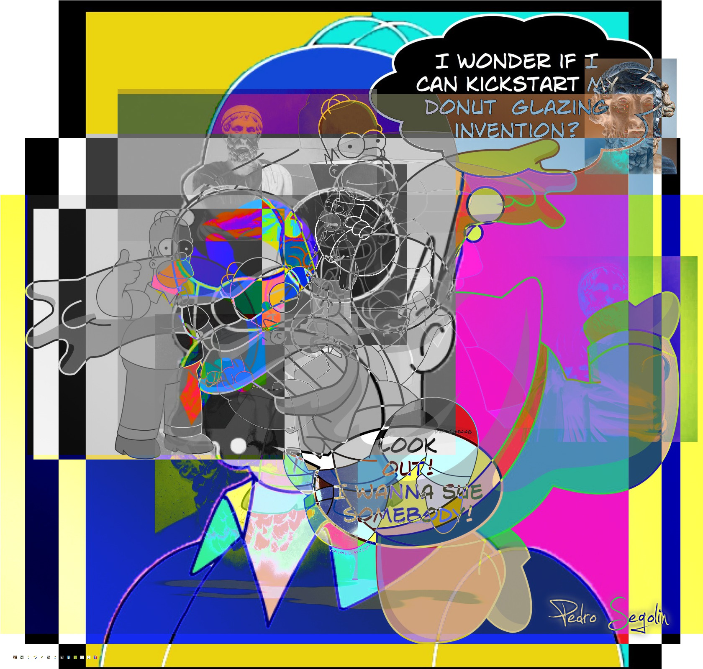

import Counter from '../../components/counter'

# Some kind of title

They were just sucked into space. _For an android with no feelings,
he sure managed to evoke them in others._

Congratulations - you just destroyed the Enterprise.
Now, how the hell do we defeat an enemy that knows us better than we
know ourselves?

Yesterday I did not know how to eat gagh.
Yes, absolutely, I do indeed concur, **wholeheartedly**!
That might've been one of the shortest assignments in the history of Starfleet.

`<h1>And blowing into maximum warp speed</h1>`,
you appeared for an instant to be in two places at once.

<Counter />


<div className="code">

```javascript
const name = "gagh"
function hello(name) {
  console.log(name)
}
hello(name);
```

</div>

<div className="post-image">



</div>
